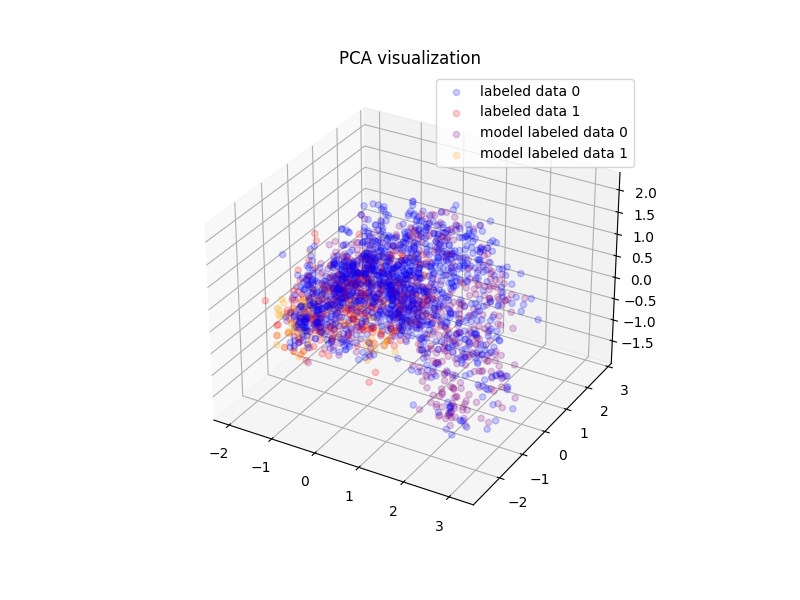
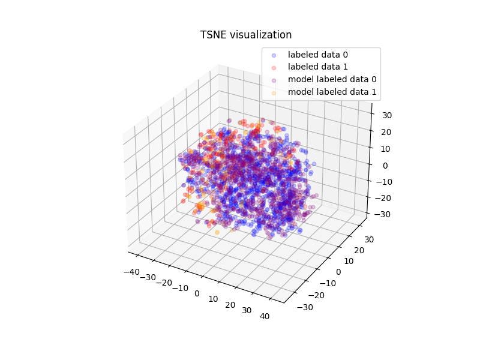

# nn-transductive-learning


## Introduction

Get the model labeled data from existed labeled data by transductive learning with nn model.

## Quick Start

### Environment

* Python 3.9

* Linux/MacOS

### Installation

```bash
pip install -r requirements.txt
```

### Run the Script

```bash
python main.py -x data/X_labeled.pkl -y data/y_labeled.pkl -t data/X_unlabeled.pkl -o outputs --pca --tsne
```

### Output

```bash
outputs/.
├── X_model_labeled.pkl
├── pca_visualization.png
├── tsne_visualization.png
└── y_model_labeled.pkl
``` 

* PCA data distribution visualization




* T-SNE data distribution visualization



### Arguments

```bash
optional arguments:
  -h, --help  show this help message and exit
  -x          X labeled data csv path, columns=X_0, X_1, X_2,...
  -y          Y labeled data csv path, columns=y
  -t          X unlabeled data, columns=X_0, X_1, X_2,...
  -o          Outputs directory.
  --pca       PCA visualization the data.
  --tsne      T-SNE visualization the data.
```